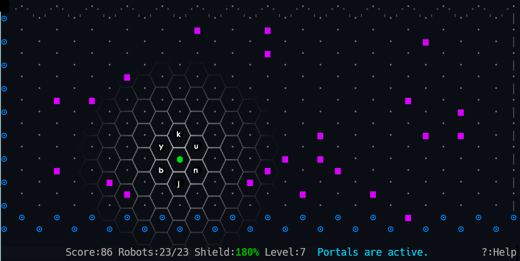

# Vim Robots

## Introduction
This is a Vim plugin implementation of the game Robots. Check out this [Wikipedia article](https://en.wikipedia.org/wiki/Chase_(video_game)) to learn its history.

There is one key difference between the classic game and this modern Vim update. The original version is based on a Cartesian grid, with movement in the usual 8 directions,...


<br/>**Figure 1:** *Robots on Cartesian grid*

but this reincarnation is based on a hexagonal grid, with movement in only 6 directions. *Disclaimer: the hexagonal tiling and letters (<kbd>y</kbd>, <kbd>k</kbd>, <kbd>u</kbd>, <kbd>n</kbd>, <kbd>j</kbd>, and <kbd>b</kbd>) in the image below are for illustrative purposes only, and are not generated during gameplay.*


<br/>**Figure 2:** *Vim-Robots on a hexagonal grid*

## Installation

Use your favorite plugin manager. [vim-pathogen](https://github.com/tpope/vim-pathogen), [vim-plug](https://github.com/junegunn/vim-plug), and [Packer.nvim](https://github.com/wbthomason/packer.nvim) are some of the more popular options. Alternatively, with Vim 8+ or Neovim, you can use packages, as Greg Hurrell ([@wincent](https://github.com/wincent)) describes in his excellent Youtube video: [Vim screencast #75: Plugin managers](https://www.youtube.com/watch?v=X2_R3uxDN6g)

## Playing the game

Start a game with the `:Robots` command.

You are the green solid circle. Robots are purple squares, and the junk piles are orange triangles. *Your colors may vary, depending on your Vim colorscheme and/or terminal color settings.*

The robots are programmed to pursue you at all costs, and will choose the shortest path to do so. They move in a straight line diagonally or vertically, but horizontal movement requires them to zig-zag randomly toward you. Fortunately, the robots are oblivious to each other, and will collide, leaving a flaming pile of junk. Your objective is to lure all the robots to walk into a junk pile or another robot, while avoiding capture, allowing you to advance to the next level.

In later levels, you can take advantage of portals to travel instantly from one edge of the field to the opposite side. Eventually, the robots will catch on, and track you down through those portals too, so be careful.

### Movement Keys

Main Keyboard | Number Keypad | Direction
:-:|:-:|---
<kbd>y</kbd> | <kbd>7</kbd> | Up left
<kbd>k</kbd> | <kbd>8</kbd> | Up
<kbd>u</kbd> | <kbd>9</kbd> | Up right
<kbd>b</kbd> | <kbd>1</kbd> | Down left
<kbd>j</kbd> | <kbd>2</kbd> | Down
<kbd>n</kbd> | <kbd>3</kbd> | Down right

### Other Commands

Key | | Function
:-:|---|---
<kbd>t</kbd>   | Transport | If you become trapped, you can transport to another location.
<kbd>w</kbd>   | Wait      | Sometimes the only winning move is not to play, but to wait and let the robots advance one step.
<kbd>F</kbd>   | Finish    | Finishing the level means waiting until defeat or triumph. Earn double the points and recharge your shield.
<kbd>?</kbd>   | Help      | Toggles the statusline to show the symbol legend and key mappings. The next move resets the statusline.
<kbd>Esc</kbd> | Boss Key  | What? You've never heard of this?

### Transporter and Shield
Your transporter and shield are closely linked. The transporter is used to whisk you away from imminent capture, but it comes at a cost. Each transport reduces the shield's strength by 100%. If the shield is below 100%, you **could** transport onto a robot or junk pile, and be captured immediately. Using the <kbd>F</kbd> key to finish a level will recharge your shield. Every robot defeated while finishing a level boosts the shield by 20%; there is no maximum.

## Customization
The symbols used to represent various items can be changed to your liking. Trails are left by the robots when you finish the level by pressing <kbd>F</kbd>. When portals are activated, special characters are used to approximate a connected edge between them. The statements shown here are what you'd use to get the retro look or to turn off the edges. The default values are in the comments following each statement.

```vim
let g:robots_empty = "\u00a0"         " Default: ·  An unoccupied cell on the board
let g:robots_robot = '+'              " Default: ■  A robot bent on capturing you
let g:robots_trails = g:robots_empty  " Default: •  The trail taken by robots after pressing F
let g:robots_junk_pile = '*'          " Default: ▲  A junk pile
let g:robots_player = '@'             " Default: ●  You
let g:robots_portal = 'o'             " Default: ⊙  A portal you can (maybe) use to escape
let g:robots_border = 0               " Default: 1  Draw (or not) lines between portals
```
